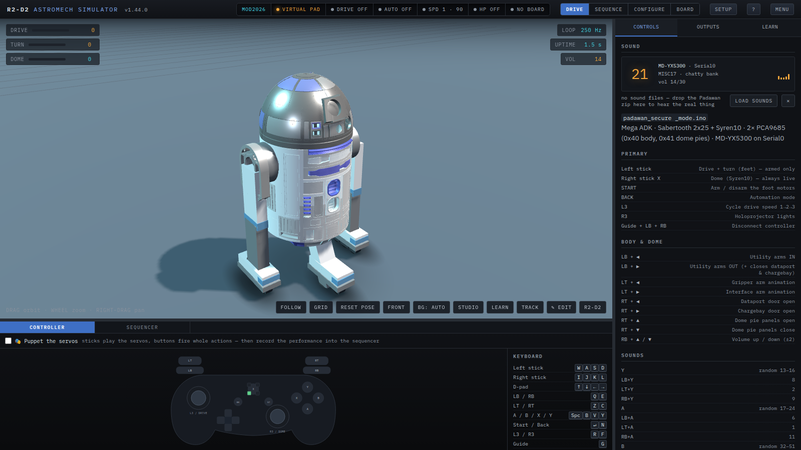
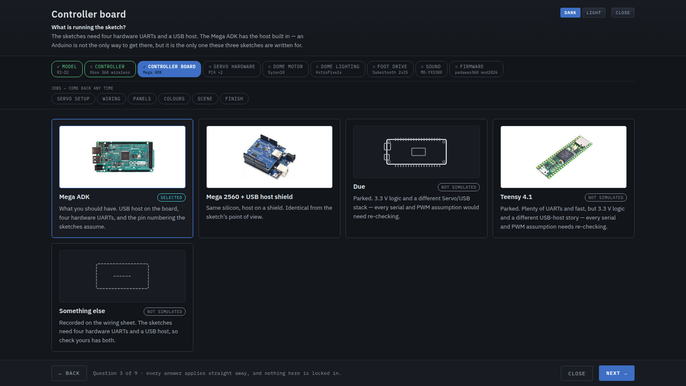
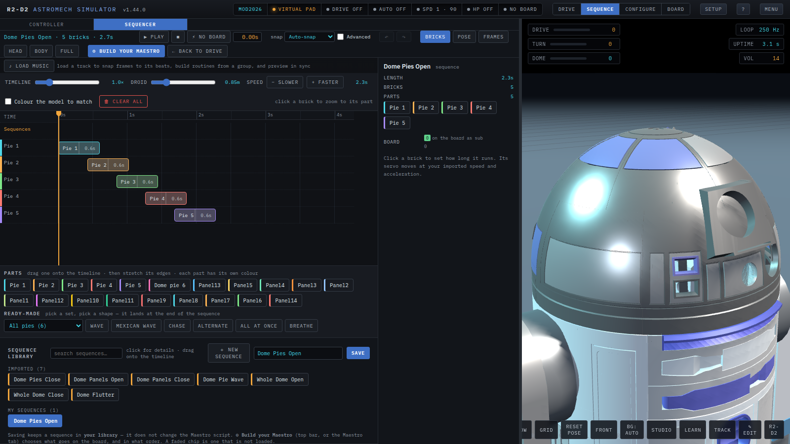

<h1 align="center">R2-D2 Astromech Simulator</h1>

<p align="center">
  <b>Build your droid in a browser before you wire a single servo.</b><br>
  Real firmware sketches, running against a model of the actual hardware.
</p>

<p align="center">
  <a href="https://github.com/mikeeddington-lgtm/r2d2-astromech-simulator/releases/latest/download/R2D2-Simulator.html"><strong>⬇ Download the ready-to-run simulator</strong></a><br>
  <sub>One HTML file · no installation · no build tools · opens in Chrome or Edge</sub>
</p>

<p align="center">
  <a href="https://github.com/mikeeddington-lgtm/r2d2-astromech-simulator/releases/latest/download/R2D2-Simulator-Manual.html">📖 <strong>The builder's manual</strong></a>
  &nbsp;·&nbsp;
  <a href="docs/manual/quickstart.html">your first hour</a>
  &nbsp;·&nbsp;
  <a href="docs/manual/bench-card.html">servo bench card</a><br>
  <sub>Twenty chapters from <i>open the file</i> to <i>drive the real board</i>, with seven short
  screen-capture clips · also one file, also offline</sub>
</p>

<p align="center">
  <sub><b>No warranty. You use this, and anything you build with it, at your own risk.</b><br>
  It models hardware — it cannot see your wiring, your supply or your linkage.</sub>
</p>

<p align="center">
  
</p>

This is a simulator for an R2-D2 build. It takes the **real Padawan360 firmware
sketches** — the ones you would actually flash — and runs them against a model
of the hardware they expect: Sabertooth and Syren motor drivers, PCA9685
expanders, Pololu Maestro servo controllers, DY-SV5W and MD-YX5300 sound boards,
an Xbox 360 receiver. The droid on screen moves because the sketch told a
modelled board to move it, not because an animation was written to look right.

That distinction is the whole point. **Several real firmware bugs have been
found here** before they ever reached a droid — a dome-automation collision, an
inverted volume convention, integer `map()` truncation — because a simulator
that models the boards honestly will disagree with a sketch that is wrong.

Everything runs **offline, from a file on disk**. No server, no build step, no
account, no internet. Open the HTML and it works.

---

## What it does

- **A guided setup** that asks what is bolted into your droid — controller,
  board, servo hardware, dome motor, lighting, foot drive, sound, firmware —
  and configures the whole simulator from your answers. Pictures on every card,
  so you can match the board in your hand.
- **The 3D droid**, rigged: every pie panel, door, arm and holoprojector on its
  own channel, driven by the sketch.
- **A servo bench** that talks to real hardware over USB (Web Serial): a
  calibration dial you turn until the panel is where you want it, and the
  endpoint is recorded against the real linkage rather than typed from a
  datasheet. Channels can be given the panel they drive by clicking a top-down
  drawing of the dome instead of hunting a dropdown.
- **A sequencer** — drag bricks on a timeline, compile to Maestro frames,
  snap to the beat of a loaded track, and drive the actual servos live. Panels
  you have not wired up yet can go in as grey bricks, so a routine can be built
  before the servos exist. On screen a channel is shut at its `min` and fully
  open at its `max`, whatever the real endpoints are, so an awkward linkage
  cannot make the model lie.
- **`.mstr` import and export**, so a Pololu Maestro settings file goes in and
  comes back out, plus a lint that encodes four faults paid for on a real bench.
  A PCA9685 `servos.h`/`sequences.h` reads back in too, and anything that cannot
  cross between the two families is named rather than silently dropped. You pick
  what an import brings — travel, routines, or both — and it says what it will
  replace before it replaces it.
- **Live drive over USB**, to a PCA9685 bridge or to the MaestroPCA
  co-processor — up to **eight boards, 128 channels**, which is also what the
  build setup will let you say you have. Move a slider, a real
  servo moves; run a routine, the droid runs it. The boards are *found* by an
  I2C scan rather than assumed, so which address jumpers you bridged does not
  matter. The app reads the sketch's boot banner and matches the channel width
  to it, so an older board is sent nothing it would decode as the wrong servo.
- **A wiring sheet** you can print, drawn from your answers (the diagrams are
  marked beta — check them against the board's own pinout before you cut a wire).
- **A practice circuit** you can redraw: a top-down editor, named layouts, gates
  and cones, per-lap timing, and barriers that space themselves to whatever
  size of track you draw.
- **Four models** on the stage: the MK4 astromech, an Anzellan (Babu Frik)
  puppet head, a Polar Mouse with its chariot, and a Model Builder for
  mechanisms of your own.
- **Sim only** — a public mode you can hand the laptop over in, with a
  temporary password on the way out.

<p align="center">
  
  
</p>

---

## Running it

**You need one file.** [Download `R2D2-Simulator.html`](https://github.com/mikeeddington-lgtm/r2d2-astromech-simulator/releases/latest/download/R2D2-Simulator.html)
and open it in **Chrome or Edge**. That is the whole installation — one
self-contained ≈7.7 MB file with three.js, the 3D model and every module
inlined. Copy it to a memory stick, take it to the workshop laptop, and it
still works.

Chrome or Edge specifically, and only for the hardware half: **Web Serial** —
the thing that lets the bench drive a real board over USB — does not exist in
Firefox or Safari. Everything else runs anywhere.

### The manual

**[`docs/manual/`](docs/manual/)** is written for the person holding a servo
rather than a compiler: twenty chapters from *open the file* to *drive the real
board*, with seven short screen-capture clips of the flows they describe. Two
printable pages sit beside it — **[your first
hour](docs/manual/quickstart.html)**, and a **[servo bench
card](docs/manual/bench-card.html)** for the workshop wall, which is every
silent failure mode this project has paid for on one double-sided sheet.

The manual itself is assembled rather than tracked, for the same reason the
dist is; `docs/manual/README.md` has the two commands that rebuild it.

### Working on it

```
git clone <this repo>
cd r2d2-sim
open dev.html          # every module as its own file — edit, refresh, repeat
```

`dev.html` is not in the repository: it is generated, like the single-file
build. Run `./build.sh` once (it needs [Node](https://nodejs.org), nothing else)
and both appear.

You only need `./build.sh` again after **adding, removing or reordering a
module**, after editing `src/html/body.html`, or after dropping a board photo
into `src/art/boards/`. Editing the body of an existing module needs nothing but
a refresh.

> **Picking this up cold? Read [`HANDOVER.md`](HANDOVER.md).** It carries the
> project state, every decision and why it was made, the traps, and a dated
> change log going back to the first version. This README is the *how*; that
> file is the *why*, and it is unusually complete.

---

## Layout

```
src/manifest.json     load order — the single source of truth for both builds
src/html/body.html    all the markup
src/css/              fourteen stylesheets, tokens first
src/js/               the modules (below)
src/art/boards/       drop a board photo in here and that setup card shows it
                      (see its own README — the file name is the whole API;
                      _originals/ keeps the untouched uploads, build ignores it)
src/vendor/           three.js r128
tools/build.js        generates dev.html and R2D2-Simulator.html
tools/split*.py       the one-off scripts that cut the original single file up
cad/convert.py        Fusion OBJ -> the MK4 .r2m (offline, run only when the geometry changes)
cad/mouse.py          the same for the Polar Mouse, plus the measured `vehicle` block
tests/                thirty-two Playwright suites (plus pca-studio/smoke.test.js)
cad/                  the offline Fusion OBJ -> .r2m pipeline (Python)
docs/shots/           screenshots
```

### The modules

Each file is its own `<script>` in both builds, so top-level `const`/`let` are
shared across all of them, and a syntax error in one cannot swallow the next.

| Area | Files | What lives there |
|---|---|---|
| `js/core/` | util, actuators, servos, motors, audio, soundbank, anims, maestro-runtime, xbox, firmware, dialog, esc-guard, toast | The hardware model. `util` has `$`/`el`/`sect`/`lg` and the Arduino maths; `servos` is the two PCA9685s; `motors` is the Sabertooth/Syren/hub layer with its watchdog; `firmware` holds `CFG`/`PROFILE`/`loadProfile`/`fwLoop`; `dialog` is `appConfirm()` — the styled, Promise-based replacement for `window.confirm()`; `esc-guard` is the four-line Escape-containment helper every overlay binds, in its own file because PCA Studio needs it too; `toast` is the bottom-left receipt for a quiet action (export, import, a sound-pack load), never more than three plates at once. |
| `js/profiles/` | mod2026, maestro-shared, maestro-sketches, registry, sketch-import | One ported sketch per file. `maestro-shared` has the loop body, hub mixing and stop-feet helpers the two Maestro sketches share. Adding a fourth firmware means a new file plus one line in `registry`. `sketch-import` is the deterministic Arduino-C → JS transpiler for the Padawan360 family — no LLM, by design, since a model quietly fixing a sketch's own bugs would defeat the point of a simulator built to expose them; anything it cannot translate fails loudly, named and lined, rather than guessing. |
| `js/input/` | gamepad, rc, rc-ui, pad-ui, puppet, cues | Real pad polling and keyboard mapping / the on-screen pad SVG. The **RC transmitter** layer (`rc`, `rc-ui`) is a radio set in USB/simulator mode: pick the device, calibrate each channel's real endpoints and rest point, then send it either into the Xbox map (so the sketch runs unchanged) or, behind Advanced, straight to a motor or servo. `puppet` turns the controller into a marionette rig — every stick half and button a spring-back servo STRING, hold-to-open or latching, silencing the running sketch's own pad reads while it is on; `cues` is the other half — a control fires a whole ACTION (a part, a group or a saved routine) instead of a raw channel, and its 3-2-1 recorder produces a brick routine, not a flat frame list, so a cued take lands straight in the sequencer library. |
| `js/scene/` | droid-proc, anzellan, mouse, builder, models, scene, camera, env | The procedural stand-in droid, the **Anzellan head** (a second animatronic on a bench stand with an 11-channel face rig — see `ANZ_ACTS`), the **Polar Mouse** (a second *drivable* vehicle: Ackermann steering, a chassis measured off the CAD, and a chariot on a hinged hitch), the **Model Builder** (`builder.js` — the fourth stage model, and the only one you build yourself: a 50 mm-grid parts bin — beam, plate, disc, hinge, ball joint — snapped together with `ATTACH TO`, forward kinematics through the THREE scene graph, joints registering `bldJ<n>`/`bldJ<n>t` acts only while it is on stage), the **stage model selection** (`models.js` — one of the four at a time, driving visibility, the pad and the ACT channels together), the renderer and lights (`LIGHTS`), the orbit camera, and the four procedural environments (studio, workshop, desert, hangar bay). |
| `js/maestro/` | boards, import, export, travel, lint, dome-map, starters, servo-store, playback, pcaseq, servo-units, servo-cfg, pca-gen, pca-gen-sim, serial-link, live-drive, hw-host, hw-clock, hw-table, setup-hw, setup-hw-cal, setup-hw-channels, hw-ui, ui-pane, blocks-host, blocks, blocks-ui, ui-sequencer, music, music-ui, ui-files, wizard-import, builder | Board variants and channel model; `.mstr` parse; `.mstr` and script generation; **`travel`** is the shared travel-time model — how long a channel physically takes to move, agreed on by the linter, the sequencer's ramp floors and PCA Studio alike; **`lint`** is the Maestro settings-file linter, four rules paid for on Mike's own bench; **`dome-map`** draws the dome top-down so assigning a board is "click the channel, click where it is"; the body/dome/Anzellan starter builders; sequence playback; **`pcaseq`/`pca-gen`/`pca-gen-sim`** are the PCA9685 route — the JS twin of the Arduino `MaestroPCA` engine, integer-for-integer, and the `sequences.h` generator both the sim and PCA Studio are built from; **`servo-units`** is the shared "what a servo will take"/ease definitions; **`servo-cfg` is the channel travel on its own** — import from a .mstr or our own export, six fields only, never the board or the panel wiring; **`servo-store` is why the channel table survives a refresh** — `HW.save()` write-throughs `MSTR` (names, endpoints, part mapping, sequences) to its own `localStorage` key and it is restored at boot before anything can generate a starter over it, which until v1.43.0 is exactly what happened; **the HW seam**, folded in from PCA Studio (`serial-link`, `hw-host`, `hw-clock`, `hw-table`, `hw-ui`, `setup-hw` + its `setup-hw-cal`/`setup-hw-channels` split-outs) — one live channel table, one Web Serial link, a fixed-10ms-quantum clock off the animation frame, and the six-step setup wizard with its calibration dial, shared verbatim by both apps; **`live-drive` is the ⚡ switch beside the transport** — armed, every routine drives the real board through the bench engine as well as the model; **`blocks-host`** is the `BLKH` seam that keeps `blocks.js`'s model (timeline, compiler, undo, snapping) sim-agnostic; the brick sequencer (`blocks`, `blocks-ui`, `ui-sequencer`) — a routine as draggable blocks compiled back to frames, with a per-brick **MOTION mode** (Opens-then-closes / Opens / Closes / Closes-then-opens, irrelevant ramp sliders hidden), **explode-on-drop** (a library sequence dropped onto the timeline expands into per-part act bricks, unassigned channels toasted rather than silently dropped) and **multi-select** (Shift/Ctrl-click, group Duplicate/Remove, Delete/Backspace, Escape to collapse); `ui-pane` and `ui-files`; the music layer (`music`, `music-ui` — beat detection, snap-to-beats, beat-driven routines, audio-clock playback); **`wizard-import`** is the guided "Import your config" route, reading a real board's file as authority rather than rewriting it; and **`builder` is Build your Maestro** — the full-screen loadout workspace (select · order · validate/lint · generate/export) opened from either the Sequencer or the Maestro tab onto the same `MSTR.loadout`. |
| `js/cad/` | decode, build, runtime, naming, parts, select, ui, payload, mouse-payload | `.r2m` container decode, mesh and paint-slot construction, actuator application, the CAD-name/actuator-ID reconciliation, the part registry (labels, colours, groups), click-to-select picking, the Model pane, the bundled MK4 geometry, and the bundled Polar Mouse. |
| `js/look/` | prefs, theme, paint, startup | `localStorage` prefs, light/dark (CSS **and** 3D scene), the paint role system, and the reusable paint/appearance section builders the wizard and the Config tab share. |
| `js/config/` | hardware, wizard, model-art, board-art, flow-art, tab, views, workspaces | The **build**: what is actually bolted into this droid. `hardware` is the option catalogue, the firmware-suitability rules and `buildApply()` — the platform first (controller, board, **firmware**, which once chosen is never silently swapped), then one **Servo hardware** question built as a form: a device dropdown (Maestro / PCA9685 / Other), the arrangement picked from **flow diagrams** (`flow-art` — Padawan → board → servos, with the ones the sketch cannot address drawn dashed), board and controller dropdowns, and a bench walkthrough for setting the servos up physically. Includes the **PCA9685 + co-processor** servo answers, where an Arduino or ESP32 running MaestroPCA answers `restartScript(n)` on the host UART exactly as a Pololu Maestro does; `wizard` is the stepped first-run overlay — **step 1 is which model you are setting up**, drawn as hand-made SVG cards (`model-art`, four of them now); every hardware card carries a picture of the thing (`board-art` — a photo if one has been dropped into `src/art/boards/`, a themed SVG stand-in otherwise); and questions the chosen model does not use are greyed but still answerable; `tab` is the Config-tab build panel and the panel↔servo assignment table; `views` is now a thin **retired shim** (v1.17.0) — the old three top-bar view modes (No config/Simple/Advanced) delegate to `workspaces` so old callers (`viewShows('pCon')` and the like) don't need to know the trichotomy is gone — plus the Save &amp; load popover and the text-size/theme controls; `workspaces` is the real navigation: **four workspaces** named for the activity rather than the audience — Drive (pad, Outputs, Learn), Sequence (the full-screen sequencer desk — entering IS `setStripMode('seq')`), Config (build + Model) and Bench (the Maestro workshop, Serial gated behind its own Advanced switch), with Outputs deliberately living in both Drive and Bench. |
| `js/app/` | animate, panels, hud, wiring, track, track-edit, tutor, board-img, boards, setup-io, splitters, shortcuts, kiosk, main | Actuator easing and model application; the sidebar panes; HUD and console rendering; the printable wiring reference; the practice circuit (`track`) and **`track-edit`, the Track Builder** — the top-down 2D circuit editor opened from the stage's ✎ EDIT button: drag control points, right-click add/remove, Gates and Cones modes, the same Catmull-Rom sampler and 2.4 m spacing check the stage itself drives so the preview cannot lie, warn-but-allow on overlap, saving into `PREFS.track`; the lessons mode; the clickable board/pin visual (`boards`, drawn over `board-img`'s measured Pololu board photos); the draggable pane splitters; the "?" shortcuts card; **`kiosk` is Sim only** — the public driving mode, its session-only password and the four guards that hold when the chrome is hidden; the boot handler and `frame()` loop. |

### Adding a module

1. Write `src/js/<area>/<name>.js`, starting with `'use strict';`.
2. Add its path to the right block in `src/manifest.json`, next to its neighbours.
3. `./build.sh`.

The build warns about any `.js`/`.css` under `src/` that the manifest does not
list, so a file you forgot to register will not silently do nothing.

**Order matters** only for parse time. A module may call another module's
functions freely, but must not *evaluate* another module's top-level `const` in
its own top-level code unless that module loads first.

---

## Tests

The sim itself needs nothing installed. The tests drive a headless Chromium, so
they need `npm install` once (Playwright is the only dependency).

Every suite launches its browser through **`tests/harness.js`** — one place
that owns the Chromium flags, which is why a suite reads `await
launchBrowser()` rather than a block of options. A suite that plays sound asks
for it (`launchBrowser({audio:true})`); anything that belongs to *all* of them
belongs in the harness.

The harness deliberately does not set Playwright's `executablePath`; Playwright
uses the Chromium installed for the current machine. If Chromium cannot be
found, run `npx playwright install chromium` rather than hardcoding a local
browser path.

```
./test.sh                       # both builds, all thirty-two suites
./test.sh dev.html              # just the dev build
R2_TARGET=dev.html node tests/maestro.test.js
```

| Suite | Covers |
|---|---|
| `firmware.test.js` | mod2026 semantics: integer `map()`, ramping, deadzones, arming, the dome-automation collision, servo endpoints |
| `profiles.test.js` | all three profiles side by side, hub-motor mixing, foot-controller toggle |
| `sketch.test.js` | the sketch transpiler: the three hand ports' own `.ino` sources plus the canonical Dan Kraus body sketch transpile with zero residue and instantiate, the transpiled mod2026 drives the same outputs as the hand port under scripted pad input, and residue is loud, named and line-numbered |
| `maestro.test.js` | `.mstr` parse/generate round-trip against Pololu's own script format |
| `maestro-import.test.js` | Import your config against Mike's real Mini Maestro 18 dome file: the parser, the exporter, the part matcher and the lint, every assertion tied to something that actually went wrong on the bench |
| `mstr-share.test.js` | sharing `.mstr` files between builders: parse-without-apply, sequences-only adoption (retargeting maths incl. an inverted mounting, unmatched channels dropped), the two-dialog choice/overwrite flow, cancel leaving everything untouched, and export writing your own channel table |
| `cad.test.js` | the MK4 model: coordinate frame, hinge axes, every rigged part moving, driven through real firmware |
| `look-boards.test.js` | setup wizard opening, paint roles, light theme, the four Maestro boards, channel mapping |
| `sequencer.test.js` | the brick sequencer (blocks compiling to frames, per-instance speeds, the library, part colours, the view-only zoom), the script loadout, the advanced motion editor, the four workspaces, and the defects from Mike's feedback handoffs |
| `sequencer-ui.test.js` | the sequencer's show-control layout: the draggable playhead, neighbour and musical-mode snapping, the grouped/searchable library whose click never clears the routine, the Advanced gate on speed overrides, imported-config authority, the colour restore on leaving the desk, and Build your Maestro |
| `build-config.test.js` | the build questions, firmware suitability and its weighting, the answers driving `SIM.profile`/`FOOT_CONTROLLER`/the Maestro board, the system wiring diagram, the consolidated Config tab, panel assignment, setup round-trip, the prefs upgrade path |
| `workspaces.test.js` | the four workspaces: the header switcher, the mod2026 gate on Sequence, both doors into the desk with prev-workspace restore, the Bench Advanced switch, tab-hop, the retired-view migration, and the setup .json round-trip of ws/adv |
| `rc.test.js` | the RC transmitter, against a deliberately awkward fake radio (uneven travel, an off-centre rest, a bottom-resting throttle, a switch on an axis): device pick, endpoint and rest calibration, the normalising maths, Mode 2 auto-assign and its two safety rules, channels reaching the sketch as hat values, direct-to-output overriding the sketch under both foot modes, and the panel itself |
| `puppet.test.js` | puppet mode: the mode switch and mapping table, auto-map, spring-back stick feel, the running sketch's own pad reads going silent while it is on, hold vs latch buttons, the 3-2-1 recorder capturing a take into the sequencer library, and replay |
| `cues.test.js` | cues: the action catalogue, one-control-one-job, hold-to-perform for parts and groups, analog partial travel, a routine cue playing live, auto-cue, and the 3-2-1 recorder producing a brick routine rather than a flat frame list |
| `wiring.test.js` | CAD names untouched, actuator ordering by azimuth, the wiring sheet and CSV |
| `hw.test.js` | the servo bench folded in from PCA Studio: the HW seam reaching MSTR, the bench engine being real, and driving a channel moving the engine, the model and (when a board is connected) the wire, in that order |
| `pcaseq.test.js` | the MaestroPCA engine (`pcaseq.js`), the JS twin of `arduino/MaestroPCA/src/MaestroPCA.cpp` kept integer-for-integer identical, and the `sequences.h` generator (`pca-gen.js`) both the sim and PCA Studio are built from |
| `select.test.js` | face-range picking, rename/colour overrides, groups (paint, drive, Maestro export) |
| `music.test.js` | beat detection on a synthetic 120 BPM click track, snap-to-beats, beat-driven routines, audio-clock playback |
| `track-ui.test.js` | practice track laps/penalties, music status line, port picker, board photos + channel picker (in-use warning), version tag, Reset button, UI scale, stage theme |
| `builder.test.js` | the Model Builder: the parts bin (beam, plate, disc, hinge, ball joint) on the 50 mm grid, `ATTACH TO` kinematics through the scene graph, the soft/hard part caps, joints registering as acts only while it is the model on stage, the `MB`/`bldJ*` vs `maestro/builder.js`'s `BLD`/`bld*` naming-collision regression, and the `PREFS.builder` round-trip |
| `setup.test.js` | window resize, audio-only playback, whole-setup export/import round trip, favourites/metals/Fusion colours |
| `sounds.test.js` | the Padawan sound bank: zip reader, real playback through both board APIs, interrupts, volume, IndexedDB persistence |
| `mouse.test.js` | the Polar Mouse and the stage selection: the payload's size and that the internals really were stripped, the chassis measured off the CAD, the pad hand-over (and that the sketch then sees centred sticks), the arc it actually drives vs `wheelbase / tan(steer)`, that it cannot turn on the spot, Ackermann both ways, the chariot pulling straight / settling in a turn / jack-knifing in reverse, and the one-model-at-a-time selector (visibility, the pad, the channels, the pane, persistence, and that the sketch keeps running regardless) |
| `kiosk.test.js` | Sim only: the bar and every surface it hides, the scene staying frozen while `loop()` keeps running, the four guards (file drop, `openStartup`, `wsSet`, the sequencer door), the exit's three answers (cancel / wrong password / right), and that nothing about the mode or its password survives a reload |
| `chrome.test.js` | the header chrome: the 1280px laptop clip, the app menu, status chips that no longer dress like buttons, and the `--cta` primary colour |
| `keyboard.test.js` | focus and keyboard: the `:focus-visible`-only ring, Esc consistency across the setup wizard, and the "?" shortcuts overlay |
| `anzellan.test.js` | the Anzellan head: geometry and the lathe winding, all eleven face channels, channels registering only while it is on stage, bipolar homes, the idle loop yielding to a driven channel, its Maestro starter and the `frik_*` animations |

They run headless on swiftshader, where simulated time runs well behind the wall
clock — **wait on `SIM.millis` or on state, never `waitForTimeout`.**

---

## Things that will bite you

- **`Object3D.lookAt()` aims +Z** for anything that is not a camera. `faceOut()`
  in `scene/droid-proc.js` compensates with a `rotateY(Math.PI)`.
- **Maestro targets are quarter-microseconds.** 6000 = 1500 µs = neutral.
- **A Maestro "close" sequence cannot be the open steps reversed step-by-step** —
  frames are absolute, so reverse the *frame list* and append the closed pose, or
  the delta encoder collapses it into bare `delay`s.
- **The Micro Maestro is a different chip** to the three Minis and writes a
  different settings file. See `js/maestro/boards.js`.
- **Actuator IDs are numbered by position, not by the CAD's numbering** — and
  only FIVE inner pies move (`pie0-4`): the MainPies are one printed piece
  with the dome and CAD `Pie6` is fixed too. The pies wear Mike's physical
  numbers ("Pie 1".."Pie 6", anticlockwise from the fixed 6 — see
  `js/cad/build.js`). Never show an actuator ID to a human without its
  label/CAD name; `js/cad/naming.js` has the helpers.
- **Regenerating the `.r2m` means regenerating `src/js/cad/payload.js` too**, or
  the bundled model goes stale against the mapping.
- **`m.base` on a moving part is its CAD base *name*, not a vector.** The mesh
  offset a hand-set pivot needs is `m.mOff`. They were the same word once, for
  about ten minutes, and it silently unrigged every part lookup in the suite.
- **A door and its clock are one feature.** The sequencer desk opened to PCA9685
  builds in v1.27.0 and `maestroStep()` — which steps every `MAESTRO.slot`,
  including a Play preview — stayed gated on `PROFILE.hasMaestro` until v1.39.3.
  Play silently did nothing on mod2026 for twelve versions. When you widen who
  can reach a feature, grep for every gate that names the OLD condition.
- **Two different `.json`s come out of this app.** The whole-setup file and the
  servo config (`kind: r2sim.servo-config`). Anything that accepts a dropped or
  picked `.json` must route on the KIND (`servoCfgLooksLikeCfg`), never the
  extension — `jsonDropRoute()` is the one place that decides.
- **⚡ Live drive is an ARM, not a mode.** It is also SEQUENCER state: leaving the
  desk clears it (v1.39.4), as does unplugging the board. The link is not closed
  and the servos are not released — they hold. `LIVE.on` only means anything while a
  board is connected and streaming (`liveOn()` also refuses kiosk), the seam is
  `applyFrameTargets`/`applyLivePose` rather than the sequencer, and unplugging
  clears the arm. Disarming leaves the servos HOLDING — a released servo drops
  whatever it was holding up.
- **Saving a routine in the sequencer does not put it on the board.** The
  script is generated from `MSTR.loadout` — the ordered list under
  **Maestro ▸ Script loadout** — so a brand-new routine has no subroutine
  number until someone loads it. Renaming a routine that is already in the
  loadout does carry its slot through (`loadoutRename()`, v1.39.5) — this
  trap only bites on a genuinely new save. That is deliberate; see §3 of
  `HANDOVER.md`.
- **Do not rebuild a pane from inside a pointer handler that is still running.**
  Both drag bugs in this project came from the same move: the node the pointer
  is on gets destroyed and its listeners go with it. Update in place
  (`blkZoomApply()`), or wait for `pointerup`.
- **The MK4 and Polar Mouse geometry is MrBaddeley's paid Patreon design**,
  included here **with his permission** — see [`CREDITS.md`](CREDITS.md). That
  permission covers this project publishing it. It does **not** travel to you:
  do not extract, repackage or redistribute `payload.js`, `mouse-payload.js` or
  the `.r2m` files. If you want the models, get them from him.

---

## Credits

This is built on other people's work — MrBaddeley's geometry, Dan Kraus's
Padawan360 firmware, three.js, and the board photographs. **Read
[`CREDITS.md`](CREDITS.md)**: it says what belongs to whom and on what terms,
and it matters more than this project's own licence does. The same list is in
the app under **Menu → About**.

## Licence

**[MIT](LICENSE)** — for this project's own code, stylesheets, hand-drawn
artwork, documentation and the MaestroPCA library. Use it, change it, ship it;
keep the notice.

**The 3D geometry is not MIT and never can be.** The MK4 and Polar Mouse are
MrBaddeley's paid Patreon designs, here with his permission for *this project*
to publish. Do not extract, print, repackage or redistribute them — buy them
from [him](https://www.patreon.com/mrbaddeley). The Padawan360 lineage stays
BSD-3-Clause, three.js is MIT, and the board photographs are the
manufacturers'. [`LICENSE`](LICENSE) spells all four out, because a licence
can only give away what the licensor owns.

## Use at your own risk

Everything here — the simulator, the manual, the sketches and every number in
them — is offered **as is, with no warranty of any kind**, and **you use it at
your own risk**.

It models hardware. It cannot see your wiring, your supply, your linkages or
your servo. Servos stall and get hot, a battery will happily push a great deal
of current into a short, and a panel closing on a finger still hurts. Check what
you are about to do before you do it, keep a way to cut the power within reach,
and treat every figure here as a starting point to verify on your own bench
rather than a setting to trust.

If something goes wrong — a damaged board, a stripped gear, a burnt-out servo,
or worse — that is on you, not on this project or on anyone who has contributed
to it. [`LICENSE`](LICENSE) says the same thing in the legal register; this is
the plain-English version, put where somebody about to wire a servo will
actually read it.

## Contributing

Issues and pull requests are welcome, with two requests:

1. **Read `HANDOVER.md` first** — most "why on earth is it done like that?"
   questions are answered there, usually with the bench session that caused it.
2. **Run the suites.** `./test.sh` drives a headless Chromium over both builds
   and PCA Studio. A change that breaks one of the ~2124 assertions has broken
   something somebody found the hard way.

If you are fixing a bug, the house style is to make the test go **red first**
against the old code, and say so in the pull request. A regression test that has
never failed proves nothing.

## Status

Actively built, by one person, for one droid — and then rather beyond it. It is
a real tool with real users of exactly one, which is worth knowing before you
depend on it. Nothing here is affiliated with, or endorsed by, Lucasfilm.
